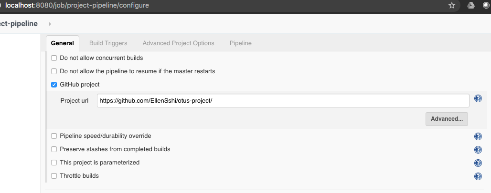
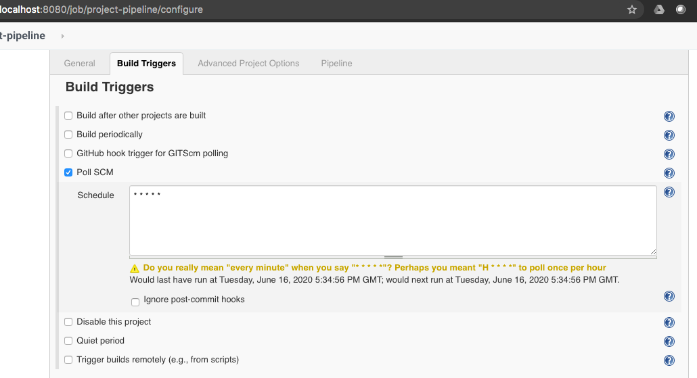
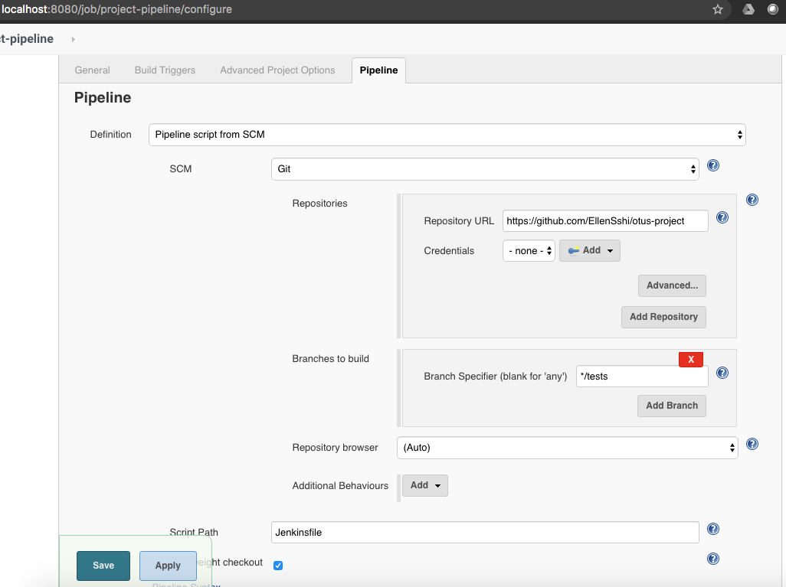
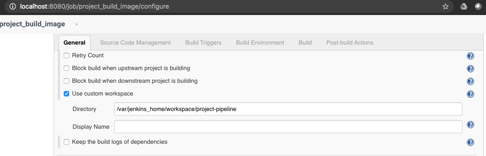
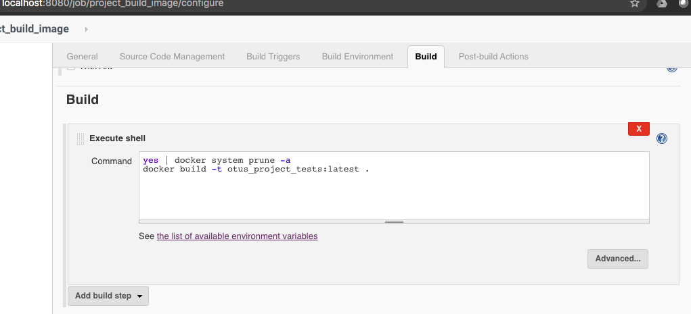
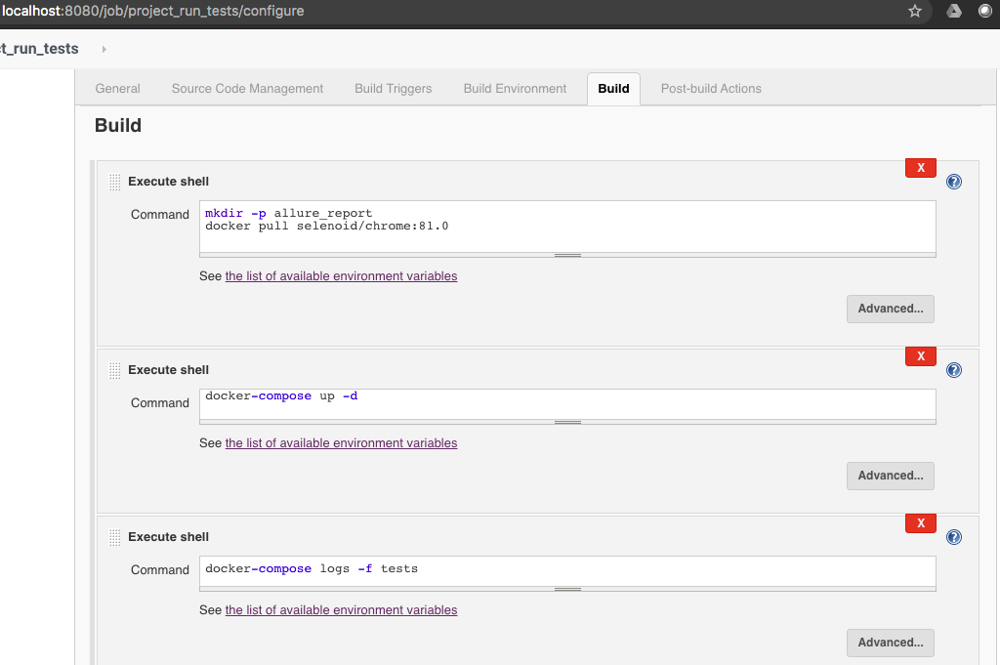
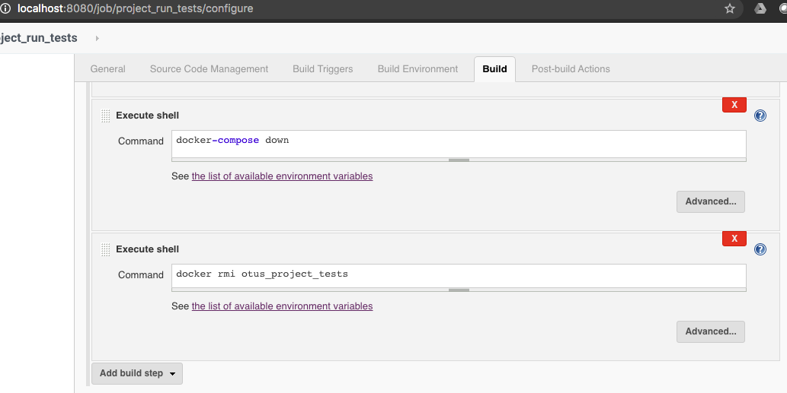
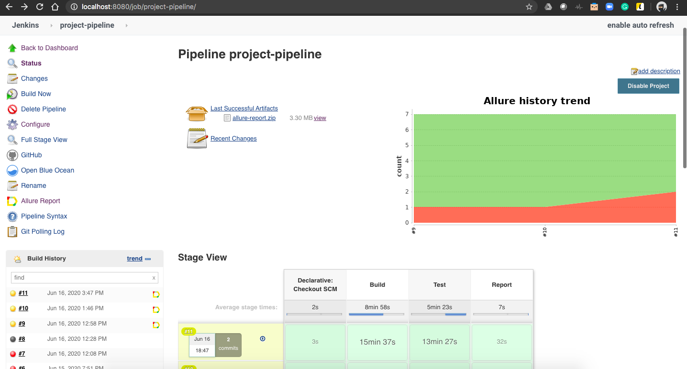
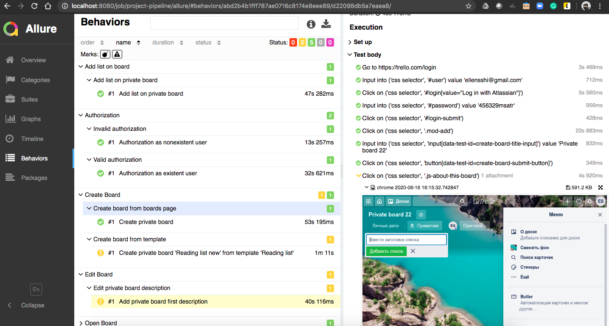

# Automated GUI-testing for Trello.com WEB-application.

## Running
1. $ Git clone https://github.com/EllenSshi/otus-project.git
2. Create venv/pyenv/pipenv and/or install python3 and pip3
3. Install requirements with $ pip install -r requirements.txt
4. Install Allure commandline application to generate a report with https://docs.qameta.io/allure/#_get_started
### Local running
1. Run tests with $ pytest -v --alluredir=allure_report

### Running tests with Selenoid
1. Install Docker with https://docs.docker.com/get-docker/
2. Install Configuration Manager for Selenoid with https://aerokube.com/cm/latest/
3. Run Selenoid with $ ./cm selenoid start
4. Run tests with $ pytest -v --alluredir=allure_report --executor=path/to/selenoid (e. g. --executor=localhost)

### Running tests in Docker using Docker Compose
1. Install Docker and Docker-compose with https://docs.docker.com/get-docker/, https://docs.docker.com/compose/install/
2. Build image with tests with $ docker build -t otus_project_tests .
3. Run Docker-compose with two containers: tests and selenoid with $ docker-compose up [-d]
4. To see logs of tests use $ docker-compose logs -f tests
5. To stop containers use $ docker-compose down

To create Allure Report use $ allure serve allure_report

### Running tests inside Jenkins
1. Install Jenkins in Docker container using https://www.jenkins.io/doc/book/installing/#downloading-and-running-jenkins-in-docker
2. To run tests with Selenoid we need Jenkins container with docker-compose, so build new Jenkins-image
with $ cd jenkins_with_docker_compose && docker build -t jenkinsci_blueocean_dc . and use it instead of standart jenkinsci/blueocean image
3. Run Jenkins containers and do some post-installation steps https://www.jenkins.io/doc/book/installing/#setup-wizard
4. Install Allure for Jenkins with https://docs.qameta.io/allure/#_jenkins
5. Create Jenkins Pipeline that contains GitHub project URL, Build Trigger and Path to Jenkinsfile

6. Jenkinsfile in this repository contains three stages: Build, Test and Report.
    #### Build stage is a Jenkins Job with one 'build step' containing commands:
    $ yes | docker system prune -a
    
    $ docker build -t otus_project_tests:latest .
    
    Build
    

    

    #### Test stage is a Jenkins job with the same custom workspace as Build Stage and several steps:
    
    Test
    

    
    
    #### Report stage is a command for generating an allure report after tests finish.
    
    Report
    
    
    
 

#
** By default Chrome Browser was used for running tests. To add some more browsers you need to pull docker image 
and add info about particular browser into .aerokube/selenoid/browsers.json